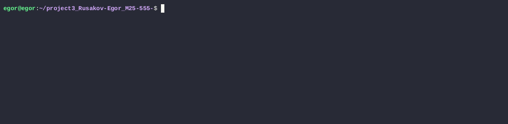

# Платформа для отслеживания и симуляции торговли валютами

## Демонстрация работы




## Идея проекта
 Платформа для отслеживания и симуляции торговли валютами, которая объединяет данные о крипто- и фиатных валютах в единой системе. Пользователи могут регистрироваться, получать виртуальные средства и совершать торговые операции на основе реальных рыночных данных.

 ### Основные возможности:
- **Регистрация и аутентификация** пользователей
- **Автоматическое обновление курсов** из внешних API
- **Локальное кэширование** курсов валют
- **Покупка/продажа** крипто- и фиатных валют
- **Управление портфелем** с конвертацией в разные валюты
- **История операций** и курсов
- **CLI интерфейс** с интерактивным режимом
    
### Поддерживаемые валюты:
- **Криптовалюты (8):** BTC, ETH, BNB, ADA, SOL, XRP, DOT, DOGE
- **Фиатные валюты (8):** EUR, GBP, JPY, CHF, CAD, AUD, RUB, CNY


### Ключевые компоненты:
1. **Core Service** - управление пользователями, портфелями, транзакциями
2. **Parser Service** - получение и кэширование курсов валют
3. **Database Layer** - JSON-based хранилище данных
4. **CLI Interface** - пользовательский интерфейс командной строки

## Установка и запуск

### Требования:
- Python 3.10+
- Poetry (пакетный менеджер)
- API ключи от CoinGecko и ExchangeRate-API

### Установка:

```bash
# 1. Клонируйте репозиторий
git clone https://github.com/d3l0st/project3_Rusakov-Egor_M25-555-.git
cd /project3_Rusakov-Egor_M25-555

 #2. Установите зависимости 
make install

# 3. Настройте API ключи 

# 4. Запустите приложение
make run
```

### Файловая сруктура проекта:
finalproject_<фамилия>_<группа>/
│  
├── data/
│    ├── users.json          
│    ├── portfolios.json       
│    ├── rates.json               
│    └── exchange_rates.json                  
├── valutatrade_hub/
│    ├── __init__.py
│    ├── logging_config.py         
│    ├── decorators.py            
│    ├── core/
│    │    ├── __init__.py
│    │    ├── currencies.py         
│    │    ├── exceptions.py         
│    │    ├── models.py           
│    │    ├── usecases.py          
│    │    └── utils.py             
│    ├── infra/
│    │    ├─ __init__.py
│    │    ├── settings.py           
│    │    └── database.py          
│    ├── parser_service/
│    │    ├── __init__.py
│    │    ├── config.py            
│    │    ├── api_clients.py        
│    │    ├── updater.py            
│    │    ├── storage.py            
│    │    └── scheduler.py          
│    └── cli/
│         ├─ __init__.py
│         └─ interface.py     
│
├── main.py
├── Makefile
├── poetry.lock
├── pyproject.toml
├── README.md
└── .gitignore               


